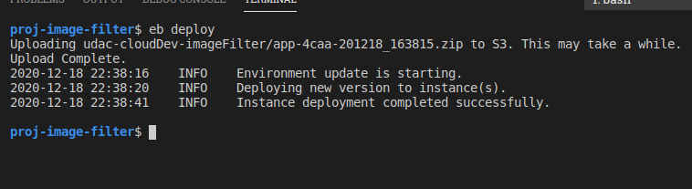
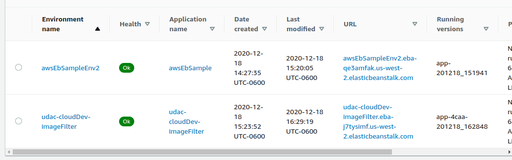
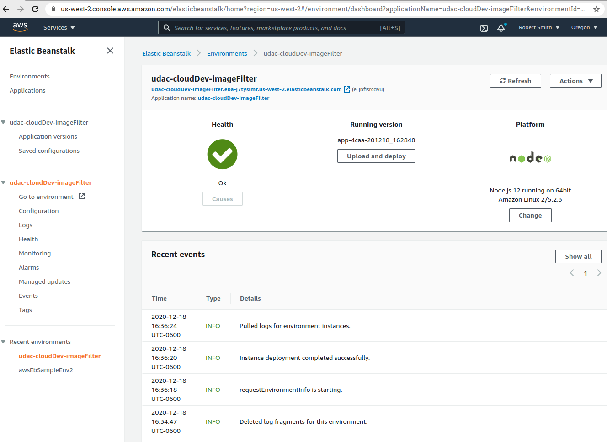
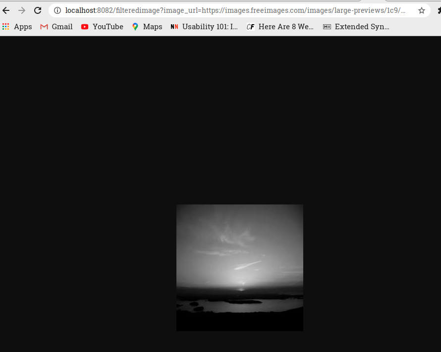
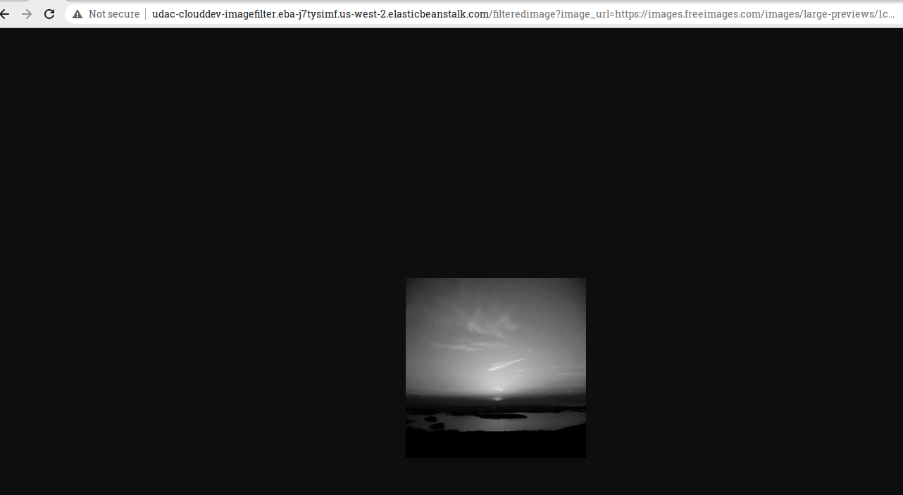

<<<<<<< HEAD
# udacityCloudDev-proj-image-filter
=======
# Udagram Image Filtering Microservice
This project provides a simple cloud application for the Udacity Cloud Engineering Nanodegree. It demonstrates knowledge and use of AWS Elastic Beanstalk(EB) for creation of an EB environment and deployment of applications to the EB Environment.

## Installation
To install the application
```
git clone <thisRepository>
cd <directoryClonedTo>
npm install
```

## Running the application
To run the application

```
cd <directoryClonedTo>
npm run dev

```


## Creating the EB Environment
To deploy the application:

```
cd <directoryClonedTo>
eb init <environmentName>

```

## Deploying the EB application
```
cd <directoryClonedTo>
npm run build
eb deploy
```

## Example URL
[Local Host URL](
http://localhost:8082/filteredimage?image_url=https://images.freeimages.com/images/large-previews/1c9/maine-at-4-45-am-1370871.jpg
)

[EB Working](
http://udac-clouddev-imagefilter.eba-j7tysimf.us-west-2.elasticbeanstalk.com/filteredimage?image_url=https://images.freeimages.com/images/large-previews/1c9/maine-at-4-45-am-1370871.jpg
)


## Reference

### Jimp 
Jimp (Javasript Image Processor) is used for the image modification (size reduction, b&W)

[Jimp](https://www.npmjs.com/package/jimp)
[Image Processing with Node and Jimp](https://blog.logrocket.com/image-processing-with-node-and-jimp/)

### Elastic BeanStalk (EB)
[Deploying Node.js applications to Elastic Beanstalk
](https://docs.aws.amazon.com/elasticbeanstalk/latest/dg/create_deploy_nodejs.html)

[EB - NodeJS Getting Started](https://docs.aws.amazon.com/elasticbeanstalk/latest/dg/nodejs-getstarted.html)


[Using the Elastic Beanstalk Node.js platform](https://docs.aws.amazon.com/elasticbeanstalk/latest/dg/create_deploy_nodejs.container.html)


## Sample Screenshots  - Deployment








## Sample Screenshots  - Working App





>>>>>>> e0e3de0a03abc6c4b474184821bb8cc82bbd0f98
